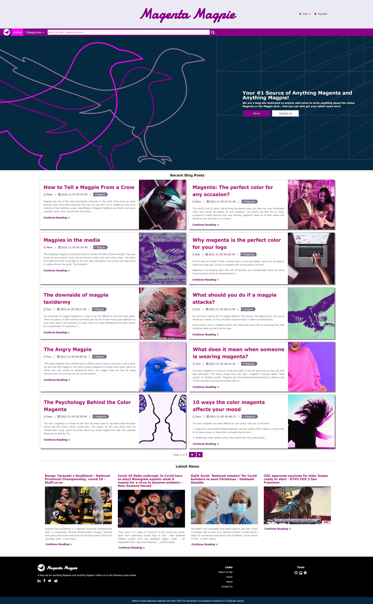

Final Project &ndash; A personal blogging system &ndash; Magenta Magpie Blog
==========

# Introduction
In this project, we have developed a blogging website using the skills we have learnt throughout the COMPSCI 719 course. The project gave us the opportunity to show how we can use online resources to discover and apply content not taught within the course.

Through the website, users can register for an account, which is needed to be able to post articles and to leave comments on others. When logged in, they have full control of the content they have authored: creating, updating and deleting their content and comments.

All in all, all of the compulsary features have been implemented.

We've given a list of compulsory requirements for the blogging system, which we have implemented. This has given us the opportunity to show our creativity and/or technical skills by adding extra feature(s).


## Extra Features

The main extra features we have implemented are:

Extra Feature 1: User is able to leave a comment to an article. If a user is not logged in, the user will be required to enter a name first before posting a comment. If a user is logged in, he can post a comment right away. A user can reply to other user’s comment. A user can also edit or delete his/her/their previous comments. A date time when a comment has been added/updated is shown as well.

Extra Feature 2: User is able to reset their account password. User must be able to enter their existing password first before proceeding to reset it. User must type the new password twice to confirm. If new passwords doesn't match, pop up an error toast message.

Extra Feature 3: Implement a proper toast message notification. A toast message needs to pop in and out of the screen whenever a certain action is done by the user ie. logs in, logs out, entered not matching passwords, username is already taken, creates an account, edits an account, deletes an account, edits an article, adds an article, deletes an article etc. The toast message should display in red for error-related messages and green for success-related messages.

Extra Feature 4: User can do a search for a certain keyword on the article title or content. When a match or matches are found, the list of articles are displayed to the user. If no match is found, a message will be displayed to the user instead. The search functionality will be available in the navbar. Use pagination to navigate through the lists of articles.

There are other extra features we have implemented and will be explained in the video.



## Project structure
This section details the structure of the given starter project, and provides information on the existing files.

### Root folder
This folder contains, amongst other things, the `package.json` file specifying the dependencies for this project. It also contains the `project-database.db` database file that stores data from the whole blog website. It also contains the node.js program entry point for the webapp - `app.js`. This file, imports and configures the following modules:

- `bcrypt`
- `cookie-parser`
- `express`
- `express-handlebars`
- `got`
- `jimp`
- `multer`
- `sql-template-strings`
- `sqlite`
- `sqlite3`
- `tinymce`
- `uuid`

The JS file also sets up the `public` folder to be served statically, and contains a single route handler which will render the `server-info` view when a user navigates to the root path (`/`).

### `modules` folder
This folder contains several custom node.js *modules*, which will be of use to you during this assignment. You do not need to modify these, nor will you need to add new ones - but it would pay to look at the ones which are there, to gain an understanding of them and how they may be used.

The included modules are:

- `database.js`: This module initialises the sqlite database package and exports a `promise` object, which is used in the dao (Data Access Object) javascript.

- `articles-dao.js`: This module interfaces with the sqlite database and performs CRUD (Create, Read, Update, Delete) operations on the `articles` table.

- `categories-dao.js`: This module interfaces with the sqlite database and performs CRUD operations on the `categories` table.

- `comments-dao.js`: This module interfaces with the sqlite database and performs CRUD operations on the `comments` table.

- `users-dao.js`: This module interfaces with the sqlite database and performs CRUD operations on the `users` table.

- `multer-uploader.js`: This module configures Multer, and exports an `upload` object which can be used to accept single file uploads.

- `handlebars-helpers.js`: This module exports functions that performs custom logic outside handlebars built-in helpers (ie. `#if`, `#unless`, `#each` etc.). These functions are used within the handlebars views, just like how you use the built-in helpers. The only difference is that they require passing in arguments, and returns boolean or string values.

- `news-api.js`: This module calls an external REST API (`https://newsapi.org/v2/top-headlines`) that will return a Json response containing the latest news from New Zealand.

- `password.js`: This module initialises the `bcrypt` package and exports functions used for encrypting and comparing passwords.

- `util.js`: This module currently exports functions that generates random integers. In the future, this module can be expanded to contain functions that can be commonly used in different modules.

### `public` folder
Contains publicly-available files - CSS and client-side JavaScript files. Most notably, it contains the following:

- `images/about`: This folder contains the Magenta Magpie team member photos used in the About page
- `images/articles`: This folder contains the cover photo for every articles
- `images/articles/thumbnails`: This folder contains smaller file versions of the articles cover photos generated using the `jimp` package
- `images/articles/upload`: This folder contains all the images uploaded through the WYSIWYG HTML editor `tinymce` when creating or editing an article. The images here will have unique filenames.
- `images/avatars`: This folder contains the avatar SVG files for registered users
- `images/branding`: This folder contains SVG files for the Magenta Magpie brand

### `routes` folder
This folder contains the JavaScript files which contain the route handlers for the blog website. Routes are separated into user accounts, articles, main application, and user authentication.

### `views` folder
Contains the Handlebars views, layouts and partials for this project. `partials` are handlebars templates that can be reused inside handlebars `views` and even other `partials`

### `sql` folder
Contains the initial sql script to populate the sqlite database file with dummy data.

## Running the existing webapp
1. To run the existing webapp, do an `npm install` then start the app using `npm start`.
2. Open the `project-database.db` using your sqlite developer and start initiating a connection to populate it with dummy data.
3. Run the `project-database-init-script.sql` to create the tables and views and insert dummy data to them. Once done, don't forget to commit/write changes to the database file.

You should be able now to browse to <http://localhost:3000/>, and see the rendered `server-info` view.

This view contains the homepage of the Magenta Magpie blog, from where a user can browse articles posts, search for titles, authors, contents, view the latest news, browse blog posts by categories or author's name, view the about page to learn about the team behind this blog site, view their contact details to reach out if there are any questions, suggestions, or raise a bug they found on the blog site, and create a user account to start creating articles or log in to their existing user account to continue writing or editing articles.

### Dummy Data
The `project-database-init-script.sql` will initially insert dummy data into `users`, `articles` and `comments` table. There are heaps of dummy data available for articles. And there are 5 dummy users available to be used to log in to the blog website:

| username | name | password |
| :---: | :---: | :---: |
| user1 | Alice | pa55word |
| user2 | Bob | pa55word |
| user3 | Peter | pa55word |
| user4 | Jane | pa55word |
| user5 | Tom | pa55word |

If you are looking for comments dummy data, only the following article's `comments` table have been populated.

```js
http://localhost:3000/articles/4
```

### Resetting the database data
If you need to restart using the blog site with fresh dummy data, after using it to create, update, delete user accounts or articles, just run the `project-database-init-script.sql` again in your sqlite database developer.